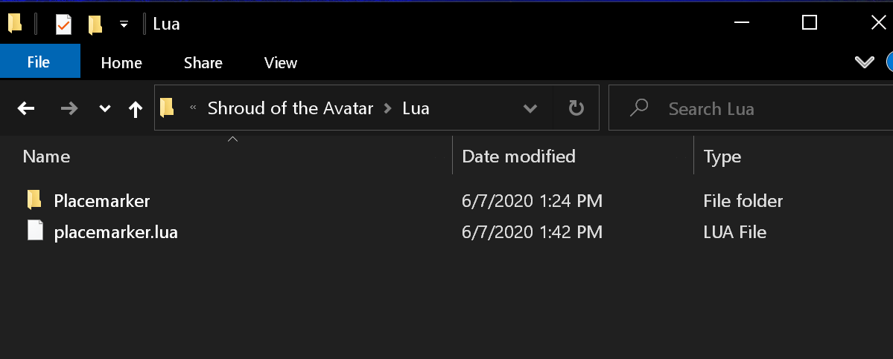

# SOTA-Placemarker
### Written by Rafael

<h3>Description</h3>
A placemarker add-on for the game, "Shroud of the Avatar" (SOTA).
 
<b>This script works only in SOTA.</b>
 
 
Download SOTA here: https://www.shroudoftheavatar.com/  
Or from Steam here: https://store.steampowered.com/app/326160/  
 
<h3>Purpose</h3>
Placemarker allows players to save locations of interest and get the distance to a chosen saved location.
 
 
<h3>Installation</h3>
Place the contents of the download folder in this repo into your game's Lua folder 
 
[Your Game's Datapath]\Portalarium\Shroud of the Avatar\Lua
 
 
For example 
 
C:\Users\Rafael\AppData\Roaming\Portalarium\Shroud of the Avatar\Lua
 

<h3> In-game setup </h3>
1. Open the game's chat console. 
2. Create a new tab, or select an existing tab. 
3. Click the gear icon and ensure `Lua` is checkmarked. 
 
Placemarker's functions can be run by clicking on the buttons, but there are some commands that must be issued through the console. 
 
Typed commands must be entered into the Local chat channel. Keep in mind, local chats are visible to other players and saved in the logs. 
 
<h3>Type commands in local chat</h3>
"!pmhelp": for list of commands 
"!pmsave": saves placemarks on your screen to a file 
"!pmload": loads placemarks from file 
"!mark some label": to manually enter a labelled placemark 
"/lua unload": removes all addons 
"/lua reload": reloads addons 
 
<h3>Button functions</h3>
"Mark": record without label 
"X": delete row from on-screen table 
"T": track distance to that placemark 
"&": append a single row to the data file 
"Clear": clear on-screen data table. Will not affect saved file 
"Vis": toggle visibility of on-screen data table 
"Save": overwrite and save data file with on-screen data. Be careful 
"Load": clear on-screen data table and load places from file. Be careful 
"Size -": decreases the size of all text and GUI elements 
"Size +": increases the size of all text and GUI elements 
